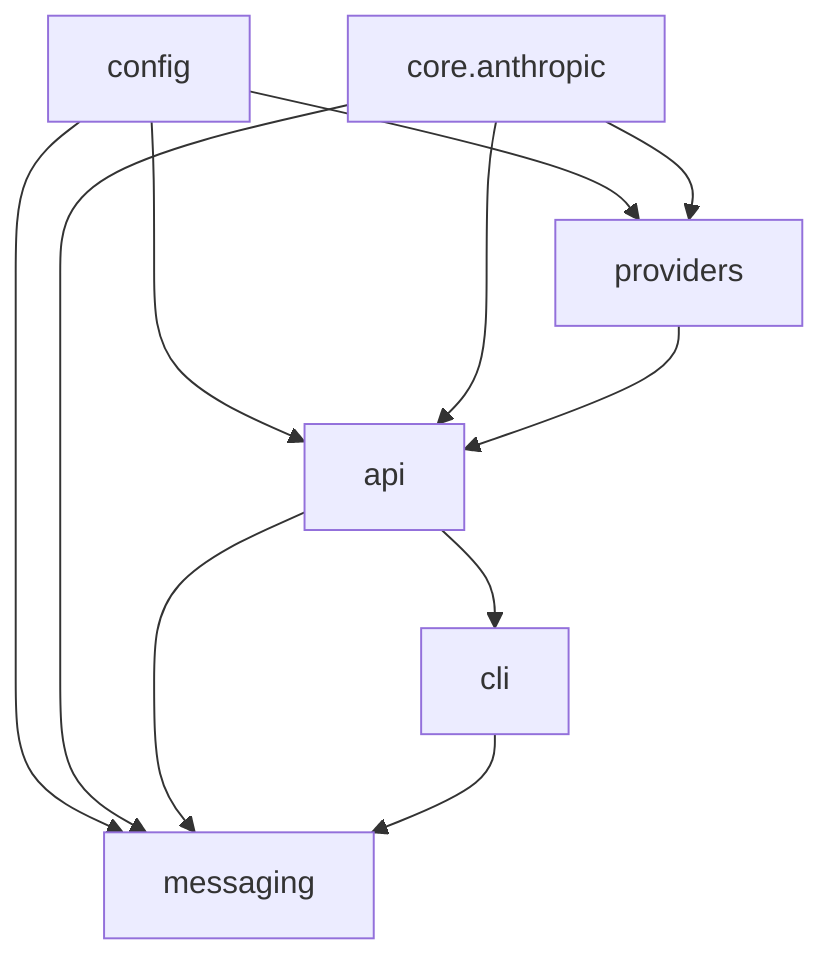

# Architecture Plan

This document is the baseline architecture guide referenced by `AGENTS.md`. It
records the intended dependency direction and the migration target for keeping
the project modular as providers, clients, and smoke tests grow.

## Current Product Shape

`free-claude-code` is an Anthropic-compatible proxy with optional messaging
workers:

- `api/` owns the HTTP routes, request orchestration, model routing, auth, and
  server lifecycle.
- `providers/` owns upstream model adapters, request conversion, stream
  conversion, provider rate limiting, and provider error mapping.
- `messaging/` owns Discord and Telegram adapters, command handling, tree
  threading, session persistence, transcript rendering, and voice intake.
- `cli/` owns package entrypoints and managed Claude CLI subprocess sessions.
- `config/` owns environment-backed settings and logging setup.
- `smoke/` owns opt-in product smoke scenarios and the public coverage
  inventory used by contract tests.

## Intended Dependency Direction

The repo should preserve this dependency order:

Runtime note: `api.runtime` imports `cli` and `messaging` to wire the optional
messaging stack; `messaging` does not import `cli` (session/CLI access is passed
in from `api.runtime`).

The practical rule is simpler than the graph: shared protocol helpers belong in
neutral core modules, not under a provider package. Provider adapters may depend
on the neutral protocol layer, but API and messaging code should not import
provider internals.

The diagram above mixes **Python import direction** (e.g. `config` → `providers`)
with **runtime composition** (e.g. `api.runtime` constructs `cli` and `messaging`).
`PLAN.md` remains the product map; **encoded** rules (including root imports like
`import api`, relative imports, and `api` → `providers` facade allowlists) live in
`tests/contracts/test_import_boundaries.py`.

**Contract highlights:** `api/` may import only `providers.base`, `providers.exceptions`,
and `providers.registry` from the providers package (not per-adapter modules).
`core/` stays free of `api`, `messaging`, `cli`, `providers`, `config`, and `smoke`.
`messaging/` does not import `api`, `cli`, or `smoke`, and may import `providers`
only via `providers.nvidia_nim.voice` (NVIDIA/Riva offline ASR). Stream contract
helpers live in `core/anthropic/stream_contracts.py`; live smoke imports that
module directly (no dedicated smoke SSE shim). NVIDIA NIM chat tuning uses the
canonical `config.nim.NimSettings` model on `Settings`; `providers.registry`
passes `settings.nim` into `NvidiaNimProvider` without a duplicate schema.
Default upstream base URLs and supported provider IDs live in
`config.provider_catalog`. HTTP handlers use `resolve_provider` with
`request.app` so the app-scoped `ProviderRegistry` is used. The `api` package
`__all__` exposes HTTP models and `create_app` only (not `app`, not dependency
helpers).
`api.app:create_app` is the ASGI factory (e.g. `uvicorn api.app:create_app --factory`);
`server.py` still exposes `server:app` as a module-level instance for convenience.

## Target Boundaries

- `core/anthropic/`: Anthropic protocol helpers, stream primitives, content
  extraction, token estimation, user-facing error strings, request conversion,
  thinking, tool helpers, and stream contract assertions
  (`stream_contracts.py`) shared across API, providers, messaging, and tests.
- `api/runtime.py`: application composition, optional messaging startup,
  session store restoration, and cleanup ownership.
- `providers/`: provider descriptors, credential resolution, transport
  factories, scoped rate limiters, upstream request builders, and stream
  transformers.
- `messaging/`: platform-neutral orchestration split from command dispatch,
  rendering, voice handling, and persistence.
- `cli/`: typed Claude CLI runner config, subprocess management, and packaged
  user-facing entrypoints.

## Smoke Coverage Policy

Default CI stays deterministic and runs `uv run pytest` against `tests/`.
Product smoke lives under `smoke/` and is enabled with `FCC_LIVE_SMOKE=1`.
Smoke runs should use `-n 0` unless a scenario is explicitly known to be safe
under xdist.

Live smoke has two valid skip classes:

- `missing_env`: credentials, local services, binaries, or explicit opt-in flags
  are absent.
- `upstream_unavailable`: real providers, bot APIs, or local model servers are
  unreachable.

`product_failure` and `harness_bug` are regressions. When a provider is
explicitly selected by `FCC_SMOKE_PROVIDER_MATRIX`, missing configuration should
fail instead of being silently skipped.

## Refactor Rules

- Keep public request/response shapes stable while moving internals.
- Complete module migrations in one change: update imports to the new owner and
  remove old compatibility shims unless preserving a published interface is
  explicitly required.
- Lock behavior with focused tests before moving shared protocol or runtime
  code.
- Run checks in this order: `uv run ruff format`, `uv run ruff check`,
  `uv run ty check`, `uv run pytest`.
